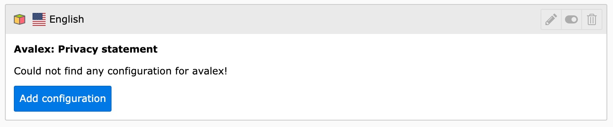
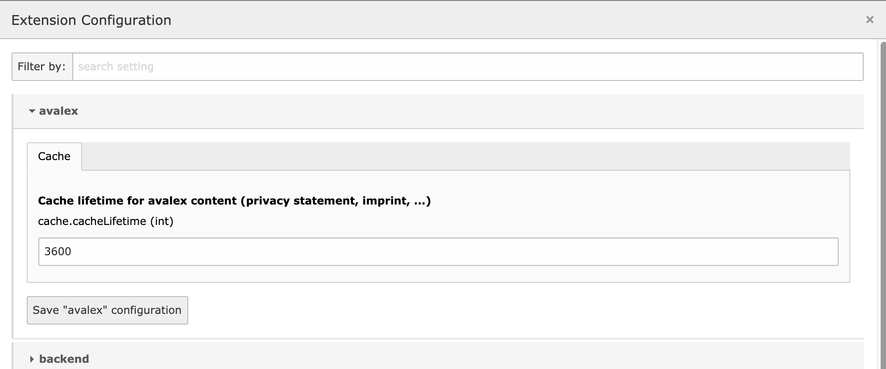
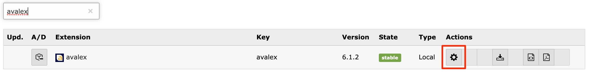

.. ==================================================
.. FOR YOUR INFORMATION
.. --------------------------------------------------
.. -*- coding: utf-8 -*- with BOM.

.. include:: ../Includes.txt

.. _admin-manual:

Administrator Manual
====================

- As a first step you should enter your domain name at https://www.avalex.de/121.html and start the analysis.
  The web site is automatically scanned for services used (i.e. Google Analytics, Facebook Pixel, Matomo, etc.).

.. figure:: ../Images/ScanWebsite.png
   :width: 300px
   :alt: Scan your website

- If a service is not detected automatically, it can be added manually by searching for the name of the service (over 300 services are currently supported, more are added as needed).
  A search for „Google” offers a list of 16 services to choose from.

.. figure:: ../Images/DetectedServices.png
   :width: 300px
   :alt: Detected services

- In addition to selecting the used services you have to answer a few questions (use of newsletters, registration, contact forms, etc.).

.. figure:: ../Images/AddServices.png
   :width: 300px
   :alt: Add services manually

- After completing the data you can download the TYPO3 extension directly from the Avalex site, however we recommend always using the latest version from the TYPO3 Extension Repository (TER), Github or Packagist.

- In the next step install the extension (Note: when upgrading from version 1.0.0 of the extension, please run the update script in the extension manager).
  No other settings are need to be made in the extension manager.

- Add a plugin from Tab „Avalex” to display one of the Avalex services on your site. In the settings of the page the cache duration should be changed from "default" to a value like "1 hour". This will ensure, that the privacy statement on the web site will be updated no later than 1 hour after the scheduler task has fetched a new version from the Avalex server (Otherwise it may take up to 24 hours).
  No further settings are necessary. The text output will be with standard h2 headers and therefore should blend with the normal content.

.. figure:: ../Images/AddPlugin.png
   :width: 300px
   :alt: Add frontend plugin

- Now it is required to add a configuration which contains the Avalex API key. Use the „Add configuration” button at one of the avalex plugins in the „Page” view for that.

- In the record you select the root page of your web site and the API key for the domain (which you get from the Avalex web site after registering for the service).

.. figure:: ../Images/CreateRecordTCA.png
   :width: 300px
   :alt: Create record

Configure caching lifetime
---------------------------

- You can configure the caching lifetime inside the Extension Configuration.

For TYPO3 and above go to Admin tools > Settings > Extension Configuration:

For TYPO3 8 and below:

Enter the lifetime in seconds you want to hold a fetched text from the Avalex API.
