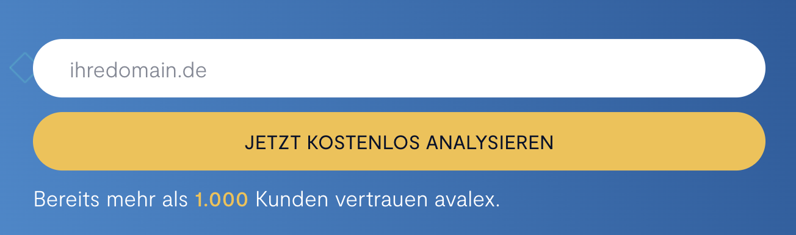
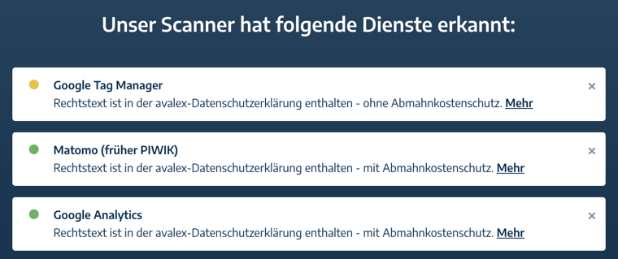
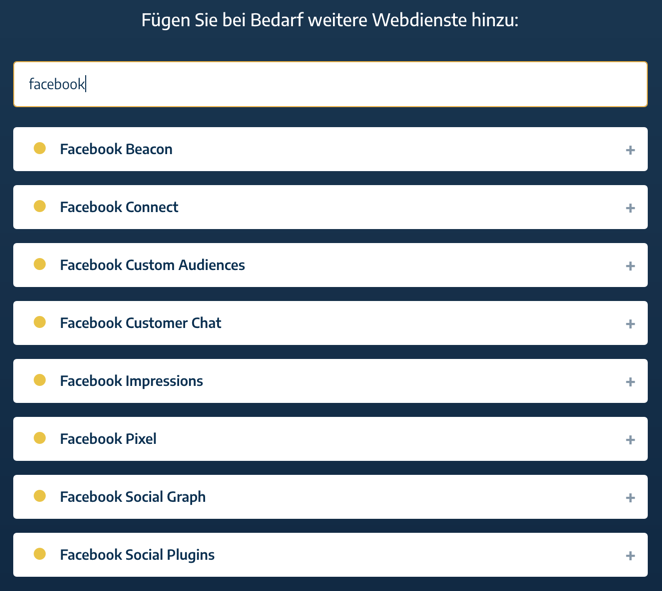
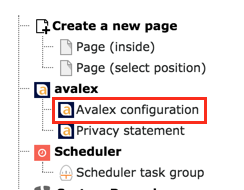
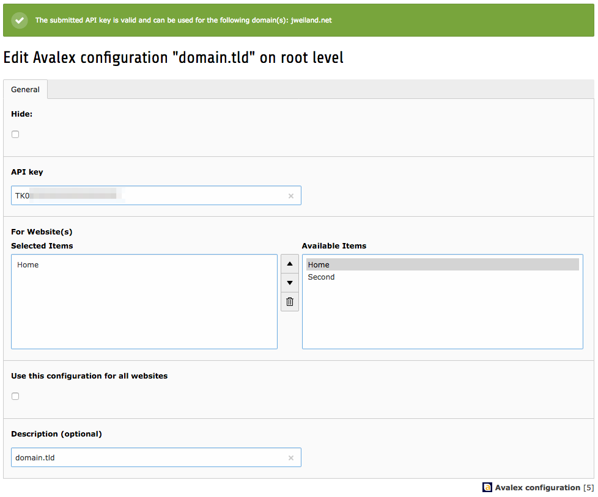
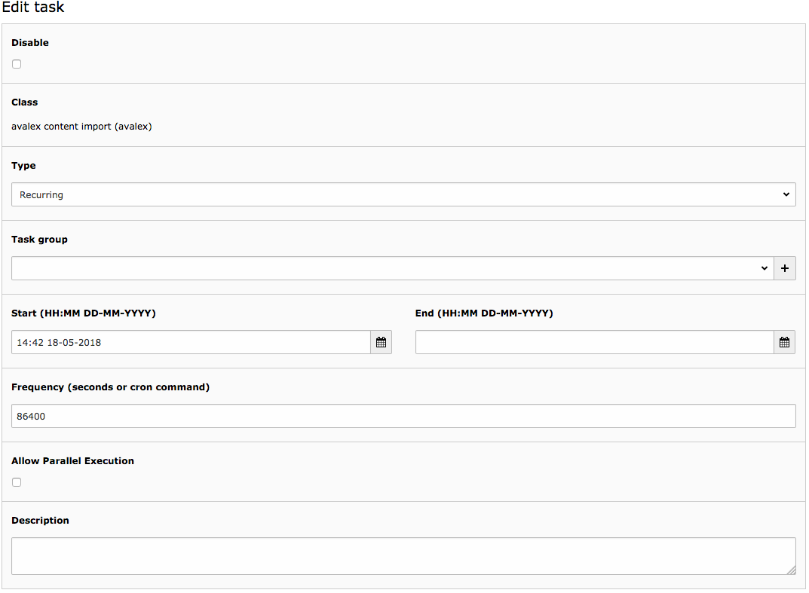
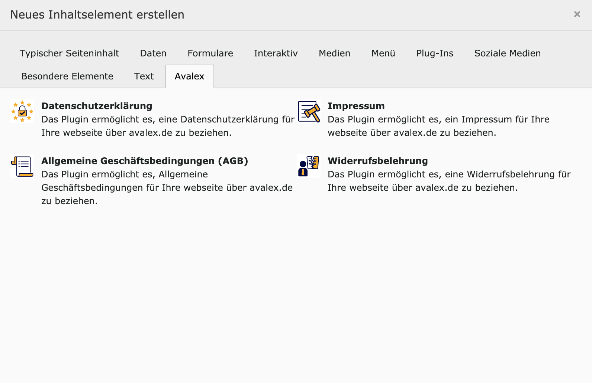

.. ==================================================
.. FOR YOUR INFORMATION
.. --------------------------------------------------
.. -*- coding: utf-8 -*- with BOM.

.. include:: ../Includes.txt

.. _admin-manual:

Administrator Manual
====================

- As a first step you should enter your domain name at https://www.avalex.de/121.html and start the analysis.
  The web site is automatically scanned for services used (i.e. Google Analytics, Facebook Pixel, Matomo, etc.).

- If a service is not detected automatically, it can be added manually by searching for the name of the service (over 300 services are currently supported, more are added as needed).
  A search for „Google” offers a list of 16 services to choose from.

- In addition to selecting the used services you have to answer a few questions (use of newsletters, registration, contact forms, etc.).

- After completing the data you can download the TYPO3 extension directly from the Avalex site, however we recommend always using the latest version from the TYPO3 Extension Repository (TER), Github or Packagist.

- In the next step install the extension (Note: when upgrading from version 1.0.0 of the extension, please run the update script in the extension manager).
  No other settings are need to be made in the extension manager, the API Base Url is https://beta.avalex.de/ .

- On the top level page in the page tree (id 0) create at least one data record of type „Avalex configuration”.

- In the record you select the root page of your web site and the API key for the domain (which you get from the Avalex web site after registering for the service).

- Go to the scheduler module and add the "avalex content import" task. Select recurring as type and a frequency you want (in seconds, default should be 21600 (6 hours)).
  IMPORTANT: Make sure, that the TYPO3 Scheduler is periodically executed by a cronjob on your server. Otherwise the task will not be executed and the privacy statement will not be updated. 
  

- To display the content from the Privacy Statement on a web site, simply include a content element of type „Plugin” on the page and select „Avalex” as the plugin. In the settings of the page the cache duration should be changed from "default" to a value like "1 hour". This will ensure, that the privacy statement on the web site will be updated no later than 1 hour after the scheduler task has fetched a new version from the Avalex server (Otherwise it may take up to 24 hours).
  No further settings are necessary. The text output will be with standard h2 headers and therefore should blend with the normal content.

